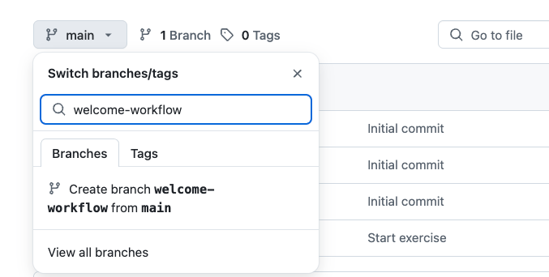

## Paso 1: Crea un workflow

### ⌨️ Actividad: Crea un workflow

1. Abre este repositorio en una pestaña nueva para que puedas trabajar mientras lees las instrucciones.

1. En la pestaña **Code** de tu repositorio, crea una nueva rama llamada `welcome-workflow`.

   

1. En la nueva rama `welcome-workflow`, ve a la ruta`.github/workflows`.

1. Crea un nuevo archivo `welcome.yml` en la ruta `.github/workflows` con este contenido:

   ```yaml
   name: Post welcome comment
   on:
     pull_request:
       types: [opened]
   permissions:
     pull-requests: write
   ```

   > 🪧 **Nota**: Este es un yaml incomplete, es normal que recibas un error. Poco a poco!😎

1. Haz commit de tus cambios directamente a la rama `welcome-workflow`.

1. Cuando hayas realizado el commit, Mona verificará tu trabajo y preparará el siguiente paso del workshop!

<details>
<summary>¿Tienes problemas? 🤷</summary><br/>

- Asegurate de que estás en la rama `welcome-workflow` cuando crees el archivo del workflow.
- Verifica la ruta del archivo y la indentación.

</details>
